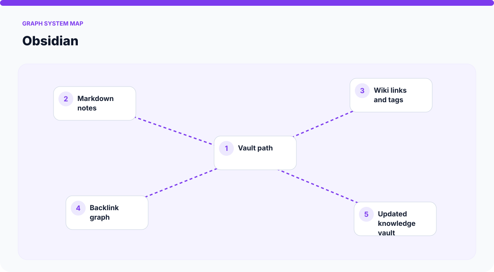
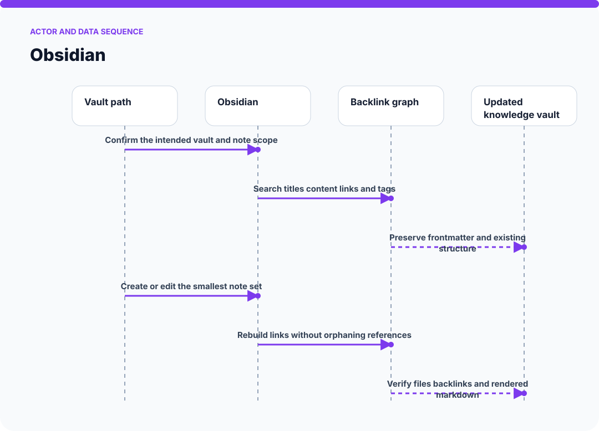
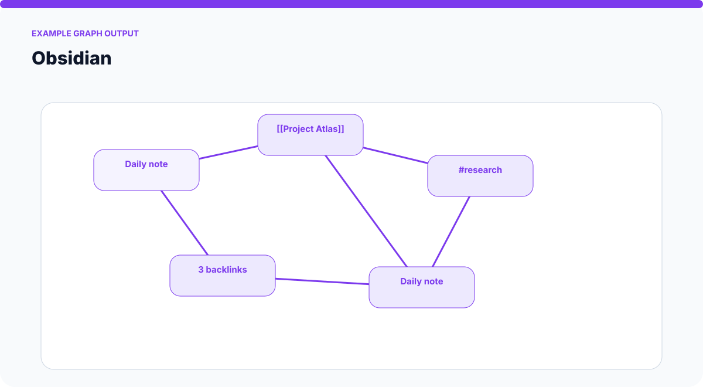
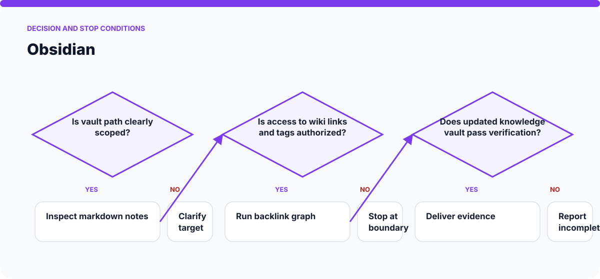

# How Obsidian Works

The visuals on this page are static SVGs, so they render directly on GitHub on phones and desktop browsers. Each one is generated from a model specific to this skill.

## System architecture

### Components

- **1. Vault path:** participates in confirm the intended vault and note scope.
- **2. Markdown notes:** participates in search titles content links and tags.
- **3. Wiki links and tags:** participates in preserve frontmatter and existing structure.
- **4. Backlink graph:** participates in create or edit the smallest note set.
- **5. Updated knowledge vault:** participates in rebuild links without orphaning references.

## Actor and data sequence

### 1. Confirm the intended vault and note scope

**Primary surface:** `Vault path`

Record the concrete input, the operation performed, and the evidence produced at this stage. Continue only when the output is sufficient for the next stage; otherwise preserve the blocker and stop.
### 2. Search titles content links and tags

**Primary surface:** `Markdown notes`

Record the concrete input, the operation performed, and the evidence produced at this stage. Continue only when the output is sufficient for the next stage; otherwise preserve the blocker and stop.
### 3. Preserve frontmatter and existing structure

**Primary surface:** `Wiki links and tags`

Record the concrete input, the operation performed, and the evidence produced at this stage. Continue only when the output is sufficient for the next stage; otherwise preserve the blocker and stop.
### 4. Create or edit the smallest note set

**Primary surface:** `Backlink graph`

Record the concrete input, the operation performed, and the evidence produced at this stage. Continue only when the output is sufficient for the next stage; otherwise preserve the blocker and stop.
### 5. Rebuild links without orphaning references

**Primary surface:** `Updated knowledge vault`

Record the concrete input, the operation performed, and the evidence produced at this stage. Continue only when the output is sufficient for the next stage; otherwise preserve the blocker and stop.
### 6. Verify files backlinks and rendered markdown

**Primary surface:** `Vault path`

Record the concrete input, the operation performed, and the evidence produced at this stage. Continue only when the output is sufficient for the next stage; otherwise preserve the blocker and stop.

## Example output shape

The example is a visual contract: a real run may look different, but it should expose comparable state, provenance, and verification information. It is not presented as evidence of a live external action.

## Decision and stop conditions

The workflow stops when the target is ambiguous, the relevant surface is unavailable or unauthorized, or the final artifact cannot be checked. A logged-in session or successful tool call is not by itself proof that the requested outcome is complete.

## Verification checklist

- Confirm every component shown in the system map exists in the target environment.
- Trace the actor sequence using actual tool output or artifact state.
- Compare the result with the example-output information contract.
- Re-read or reopen the final artifact instead of trusting an attempt message.
- Report omitted stages, unsupported capabilities, and remaining human decisions.
